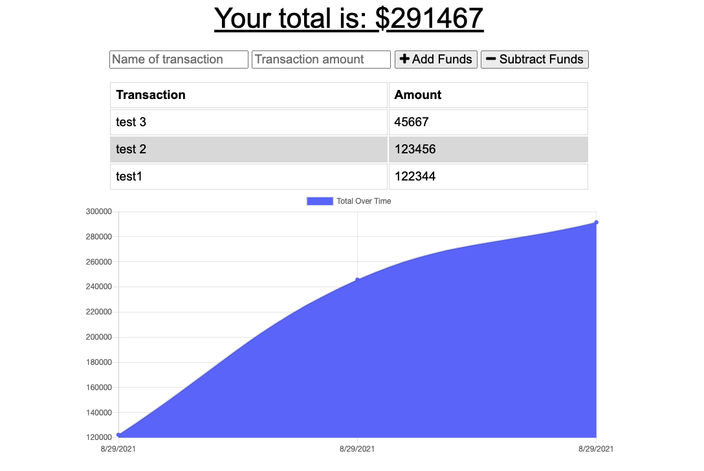

# Budget Tracker
A budget tracking app that allows users to track their withdrwlas and deposits with or without internet connection.

## Table of Contents
- [Purpose](#purpose)
- [PWA](#PWA)
- [Technologies-Used](#Technologies-Used)
- [Deployed-App](#Deployed-app)
- [Contact](#Contact)

## Purpose
The budget tracker app gives users a fast and easy way to track their money an any time. This app is a fully functional progressive web application(PWA) meaning that users are able to use it when offline or with weak network connection. With this the user will be able to add expenses and deposits to their budgets with or without a connection.

## PWA
Becasue this application is a mobile-first app, it contains a web manifest to let users' devices know what they are installing and how the app should look on the home screen. The app also contains an indexedDB to add offline functionality and has a registered service worker.

## Technologies-Used 
- MongoDB as its database
- MongoDB Atlas
- mongoose
- node.js
- express.js

## Deployed-App
To run the application clone the code and run npm start on the terminal or you can view the application deployed on [heroku](https://budget-tracker-app-2.herokuapp.com/) 

## Contact
If you have any questions feel free to contact me through my [Github](https://github.com/Araceli4690).